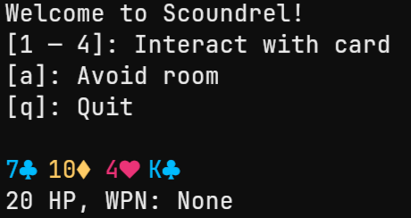

# Scoundrel

<p align="center">
  
</p>

A roguelike card game in the terminal, written in Rust 🦀

Scoundrel was designed by Zach Gage and Kurt Bieg. You can read the rules [here](http://stfj.net/art/2011/Scoundrel.pdf)!

> I'm not affiliated with them, by the way. Am I legally required to say that?

## Compiling from source

Make sure you have [Rust installed](https://www.rust-lang.org/tools/install) first!

```bash
$ git clone https://github.com/massivebird/scoundrel
$ cd scoundrel
$ cargo run --release
```
